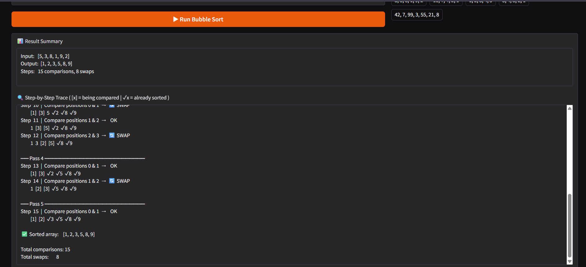

Bubble Sort Visualizer
Demo

Problem Breakdown & Computational Thinking
Why Bubble Sort?
Bubble Sort was chosen because its step-by-step swapping behaviour is easy to visualize and explain. Every comparison and swap is visible, making it ideal for helping someone learn how sorting works from scratch.
The Four Pillars
1. Decomposition
The problem breaks into smaller tasks:

Accept raw text input from the user
Parse and validate the input into a list of integers
Run the sorting algorithm while recording each step
Render the steps in a human-readable format
Display everything through a clean UI

2. Pattern Recognition
Bubble Sort repeats the same action over and over:

Compare two adjacent elements
Swap them if they are out of order
Move to the next pair
After each full pass, the largest unsorted element is in its final position

3. Abstraction
Details hidden from the user:

Index tracking is done internally
The "sorted boundary" (how many elements are already in place) is tracked automatically
The early-exit optimisation (stop if no swaps occurred in a pass) runs silently

4. Algorithm Design — Input → Processing → Output
INPUT:   User types comma-separated integers  (e.g. "5, 3, 8, 1")
           ↓
PARSE:   Validate and convert to [5, 3, 8, 1]
           ↓
SORT:    Run bubble_sort_steps() — records every comparison & swap
           ↓
FORMAT:  Convert step list to readable trace with pass headers
           ↓
OUTPUT:  Display summary, full step trace, and complexity explanation
Flowchart
Start
  │
  ▼
Get user input
  │
  ▼
Valid integers? ──No──▶ Show error message ──▶ Stop
  │
 Yes
  ▼
For each pass (until no swap or end of array):
  │
  ├─▶ Compare arr[i] and arr[i+1]
  │       │
  │       ├─ arr[i] > arr[i+1]? ──Yes──▶ Swap  ──▶ Record SWAP step
  │       │
  │       └─ arr[i] ≤ arr[i+1]? ──────────────▶ Record OK step
  │
  └─▶ (repeat for all unsorted pairs)
  │
  ▼
No swaps in last pass? ──Yes──▶ Done (early exit)
  │
  ▼
Display sorted array + full trace
  │
 End

Steps to Run
Run Locally
bash# 1. Clone the repository
git clone  https://github.com/Trevin113/CISC121-Final-Poject.git

Hugging face link ; https://huggingface.co/spaces/trevin-11/hello.65/blob/main/README.md

# 2. Install dependencies
pip install -r requirements.txt

# 3. Launch the app
python app.py
Then open the URL shown in your terminal (usually http://127.0.0.1:7860).
Use the App

Type a comma-separated list of integers in the input box — e.g. 5, 3, 8, 1, 9, 2
Click ▶ Run Bubble Sort
Read the step-by-step trace:

[x] means that element is currently being compared
✓x means that element is already in its final sorted position
🔄 SWAP means the two elements were out of order and were swapped
 OK means no swap was needed

Testing & Verification
The app was tested against the following cases:
InputExpected OutputResult5, 3, 8, 1, 9, 21, 2, 3, 5, 8, 9✅ Pass1, 2, 3, 4, 51, 2, 3, 4, 5 (0 swaps — best case)✅ Pass5, 4, 3, 2, 11, 2, 3, 4, 5 (worst case — max swaps)✅ Pass42 (single element)Error: need at least 2 numbers✅ Passa, b, cError: not valid integers✅ Pass1, 2, three, 4Error: 'three' is not a valid integer✅ Pass[] (empty)Error: please enter numbers✅ Pass21 numbersError: 20 or fewer please✅ Pass
All edge cases were handled gracefully with helpful error messages rather than crashes.

Author: Trevin Singaraja
Course: CISC-121
Date: April 5th, 2026
Acknowledgments:

Gradio documentation — UI framework used for the interactive interface
VisuAlgo — Referenced for understanding how sorting visualizations are typically presented
Hugging Face Spaces — Used for hosting and deployment
Claude Sonnet 4.6 - AI level 4 used to assist with the app.py file